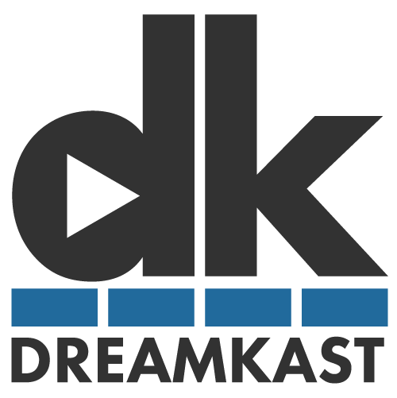

# dreamkast

<div align="center">

</div>

Online Conference System written in Ruby on Rails

## About Dreamkast platform

See [Docs](docs/README.md)

## Prerequisites

- Docker Compose
- Auth0 application keys

## How to create auth0 applications keys

See [Auth0 document](https://auth0.com/docs/quickstart/webapp/rails/01-login)

After create configuration, create `.env` file in the top-level directory.

```
AUTH0_CLIENT_ID=FVYbe7dsf1fowelsdlkdsfLwofArfNUznaeku
AUTH0_CLIENT_SECRET=jBeB2Jd4sdfsdfdgetwarzOXYsdEyasdfq3wer3r9wglkj129UoF_XJuD
AUTH0_DOMAIN=yourdomain.auth0.com
```

Docker compose read `.env` file automatically.

If you are running a rails server without Docker compose, you need to set environment variables like this.

```
export AUTH0_CLIENT_ID=FVYbe7dsf1fowelsdlkdsfLwofArfNUznaeku
export AUTH0_CLIENT_SECRET=jBeB2Jd4sdfsdfdgetwarzOXYsdEyasdfq3wer3r9wglkj129UoF_XJuD
export AUTH0_DOMAIN=yourdomain.auth0.com
```

## How to setup environment

This repository works with

- Ruby
- Node.js
- Yarn
- Docker Compose (for MySQL and Redis)
- AWS CLI

the version is controlled by `.node-version` and `.ruby-version` file.

`nodenv` and `rbenv` are recommended to install those.

You need to install shared-mime-info

- macOS: `brew install shared-mime-info`
- Ubuntu, Debian: `apt-get install shared-mime-info`

```
$ yarn install --check-files
$ bundle install
$ bundle exec rake webpacker:compile
```

Then, create `.env-local` file and fill these values. If you don't know correct values, please ask us.

```
export AUTH0_CLIENT_ID=
export AUTH0_CLIENT_SECRET=
export AUTH0_DOMAIN=
export SENTRY_DSN=
export AWS_ACCESS_KEY_ID=
export AWS_SECRET_ACCESS_KEY=
export S3_BUCKET=
export S3_REGION=
export MYSQL_HOST=db
export MYSQL_USER=user
export MYSQL_PASSWORD=password
export MYSQL_DATABASE=dreamkast
export REDIS_URL=redis://redis:6379
export RAILS_MASTER_KEY=
export SQS_MAIL_QUEUE_URL=http://localhost:9324/queue/default
export SQS_CHAT_QUEUE_URL=http://localhost:9324/queue/chat
```

Next, configure awscli and logged in registry using it.

```
source .env-local
aws ecr get-login-password | docker login --username AWS --password-stdin http://607167088920.dkr.ecr.ap-northeast-1.amazonaws.com/
```

Then, setup databases, ui and load balancer by running Docker Compose

```
$ docker-compose pull ui
$ docker-compose up -d db redis nginx ui
```

Run the application

```
$ ./entrypoint.sh
```

## For local development

Run Webpack dev server in case you want to edit JavaScript.

```
$ ./bin/webpack-dev-server
```

## Ruby Type

### Generate RBS files for Rails

https://github.com/pocke/rbs_rails

Generate RBS files for Rails (e.g. ActiveRecord models) to  under`sig/rbs_rails/`. You don't need update files by this rake task because these are auto geretated files.

```
$ rake rbs_rails:all
```

### Generate RBS files for your application code

If you want to generate RBS for your application code, you can use `rbs prototype` . This command generate prototype RBS file by your code. You can edit generated RBS file.

```
$ rbs prototype rb ./app/models/access_log.rb > sig/app/models/access_log.rbs
```

## DB migration and to add seed data

```
$ bundle exec rails db:migrate
$ bundle exec rails db:seed
```

## Mock SQS for local chat development

```
aws --endpoint-url http://localhost:9324 sqs create-queue --queue-name chat
```

## How to use REST API for VideoRegistration

### Retrieve CLIENT ID and CLIENT SECRET from Auth0

https://manage.auth0.com/dashboard/us/dreamkast/applications/Piz0aBnXn0vxesyZScc76PgdCB7lCAbk/settings

### Generate JWT Token

```
AUTH0_DOMAIN=dreamkast.us.auth0.com
CLIENT_ID=<CLIENT ID>
CLIENT_SECRET=<CLIENT SECRET>
AUDIENCE=https://event.cloudnativedays.jp/
TOKEN=$(curl --url https://${AUTH0_DOMAIN}/oauth/token \
  --header 'content-type: application/json' \
  --data "{\"client_id\":\"${CLIENT_ID}\",\"client_secret\":\"${CLIENT_SECRET}\",\"audience\":\"${AUDIENCE}\",\"grant_type\":\"client_credentials\"}" | jq -r .access_token)
DREAMKAST_DOMAIN='event.cloudnativedays.jp'
```

※ Don't retrieve JWT token frequently due to Auth0 limitation. We recommend store generated token into environment variable. Generated token is available 1 day.

### Get VideoRegistration

```
curl -X GET -H "Authorization: Bearer $TOKEN" https://$DREAMKAST_DOMAIN/api/v1/talks/1/video_registration
```

### Set URL

```
curl -X PUT -H "Authorization: Bearer $TOKEN" https://$DREAMKAST_DOMAIN/api/v1/talks/1/video_registration -d '{
  "url": "https://foobar"
}'
```

### Set video status

You can set these values in status.

- unsubmitted
- submitted
- confirmed
- invalid_format

```
curl -X PUT -H "Authorization: Bearer $TOKEN" https://$DREAMKAST_DOMAIN/api/v1/talks/1/video_registration -d '{
  "status": "confirmed",
  "statistics": {
            "file_name": "XX",
            "resolution_status": "OK",
            "resolution_type": "FHD",
            "aspect_status": "OK",
            "aspect_ratio": "16:9",
            "duration_status": "OK",
            "duration_description": "Appropriate media duration.",
            "size_status": "OK",
            "size_description": "Appropriate media size."
          }
}'
```

## Run rubocop automatically

```
git config pre-commit.ruby "bundle exec ruby"
git config pre-commit.checks "[rubocop]"
```
