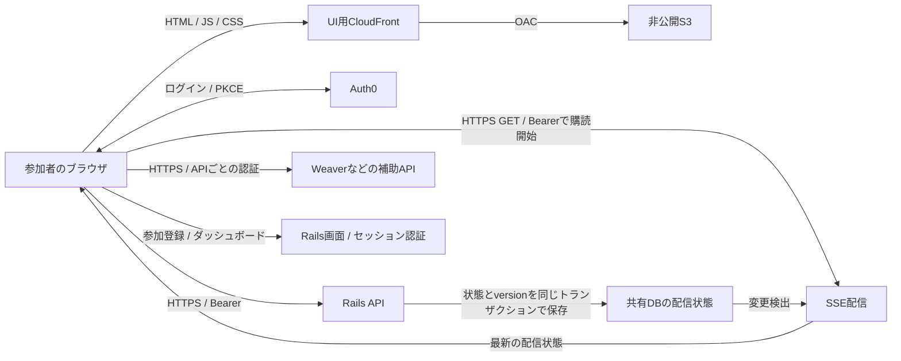

# ADR-003: dreamkast-uiの静的配信・API認証の独立化・SSEへの移行

ステータス: 提案。2026-09-13のローカルコード調査に基づく実装計画。

運用前提: チャットは廃止済み。ライブ配信のセッション切り替えを主用途として、WebSocketをSSEへ置き換える。コード上の残存機能を、そのまま今後の必須機能とは扱わない。

調査対象: dreamkast `c515fe3b`、dreamkast-ui `ecaa967`。Auth0テナント、本番LB、AWSリソース、Weaver/SAMの実装は未確認。本書ではコードで確認できた事実と推奨する変更を区別する。

## 方針

dreamkast-uiを、Next.jsの静的exportで生成する画面と、ブラウザからのAPI呼び出しに分ける。配信はCloudFront + 非公開S3、認証は既存Auth0のSPA向けAuthorization Code Flow with PKCE、保護されたAPIは既存のBearer Access Tokenを使用する。

Railsの参加登録・ダッシュボード・管理画面は、引き続きRailsのセッションで利用する。同じAuth0テナントのSSOで画面間を移動できるようにし、UIのAPI呼び出しをRails Cookieから独立させる。RailsとUIが別々のホストにあっても機能する構成を完成条件とする。

静的生成するのは画面の枠組み・JS・CSS・画像。プロフィール、配信状態、Q&A、視聴者数は実行時に取得する。イベント当日のデータ更新にUIの再ビルドは不要とする。配信状態の通知はSSE、操作は既存HTTP APIを利用し、チャットとAction Cableへの依存を撤去する。



UI用Node.jsコンテナと、UI・Railsを同一ホストに見せるための共通LBへの依存をなくす。Rails APIやSSEの入口にLBを利用するかは、バックエンドの配置要件で選べる。SSEも接続を維持するバックエンドは必要であり、S3は静的UIの配信を担当する。削減額は現行のUIタスク・LBの共有状況、CDN転送量、SSEの同時接続コストを確認して見積もる。

## 現状から分かったこと

以下のパスは、特記がなければdreamkastリポジトリを基準とする。

| 項目 | コードで確認した現状 | 計画への影響 |
| --- | --- | --- |
| UIの認証 | dreamkast-ui `src/context/auth.tsx`はAuth0Providerを使用。`src/store/baseApi.ts`はBearerを送信 | 認証方式の新設より、既存実装の完成を優先する |
| Rails REST API | `SecuredPublicApi` / `SecuredAdminApi`がJWT検証。my_profile、Q&A、受付などは導入済み。Cookie用`SecuredApi`のincludeは見つからない | 主要REST APIをCookieから一斉移行する作業は不要。廃止済みチャットのAPIは撤去対象 |
| JWT検証 | `app/middlewares/json_web_token.rb`はRS256、issuer、audienceを検証。検証のたびにJWKSをHTTP取得 | 共通化、claimの契約、鍵キャッシュと障害時動作を整える |
| 静的化 | Next.js 14.2.35 / Pages Router。4ページの`getServerSideProps`はENVをpropsに渡すだけ。`_app.tsx`にも`getInitialProps`がある | ページ本体のデータ取得はCSRを活用できる。実行時設定注入を置換する |
| URL | `[eventAbbr]`配下の画面とポイントID付きURLがある | ビルド時の生成対象を明示する必要がある |
| WebSocket | UIの`useLiveTalkUpdate`はOnAirChannel、表示中のSessionQAはQaChannelを購読。RailsにもTrack / Waiting / OnAir consumerが残る。接続は未認証を拒否していない | ライブ切り替えはSSE、Q&AはREST取得、廃止チャットは削除へ振り分け、全consumerの移行後にAction Cableを撤去 |
| CORS | Railsは`https://im.emtec.tv`のみ許可。開発NginxはCORSヘッダーを上書き | Rails単独の別originテストが必要。本番LB設定は別途確認 |
| 補助API | UIのApolloはWeaver `/query`を使用し、Bearer付与処理はない。開発Nginxはpoint、app-data、旧viewer_count等をSAMへ転送 | API Base URLをRailsに変えるだけでは接続先が欠落する |
| TrailMap | 画面・初期化はコメントアウト済みだが、廃止済みチャットのコードにpoint API呼び出しが残る | チャットに結びついた処理は削除対象。他の有効機能の実利用は別に確認 |
| 配信 | 通常Dockerfileは`next start`。古いDockerfile-staticは`next export`と`cndt2021`固定パスを使用 | 現行Next.js向けのexportとCI/CDを用意する |

さらに、未認証のtalks/tracks APIにも`videoId`やplayback URLが含まれる。`TalksController#update`にはBearer認証はあるが、操作対象イベントの管理権限チェックは見当たらない。これらは静的化で新しく生まれる性質ではないが、公開情報と操作権限の契約を固める際に扱う。

## 方式の選択

| 選択肢 | 評価 |
| --- | --- |
| **Next.js静的export + Auth0 SPA + Bearer API** | 推奨。既存実装を活用でき、ホスティングとAPIのドメインを独立させられる |
| 静的UI + Rails Cookieをcross-originで利用 | 同一サイトのサブドメインでは選択肢になるが、credentials・CSRF・Cookie制約の管理が残り、別サイトへの配置に制限がある |
| CloudFrontのパス振り分けで同一originを維持 | UIコンテナを減らす中間策にはなる。認証・URLの同一origin依存を解消した完成形とは別に扱う |
| Vite + React RouterのSPAへ移行 | 新イベントを再ビルドなしで扱う要件が必須なら有力。初回はNext.jsの書き換え量を抑え、有限のイベント一覧から生成する |

初回は現行Pages Routerを維持する。Next.js 14では`output: 'export'`を指定して`next build`で生成する。`getServerSideProps`、`fallback: true / 'blocking'`、実行時のNext.js rewrites等は利用できない。[Next.js 14公式資料](https://nextjs.org/docs/14/pages/building-your-application/deploying/static-exports)

## 認証・認可の設計

### REST API

1. Auth0の同一テナントに、UI用SPA ApplicationとRails用Regular Web Applicationを設定する。既存UI clientの種別・設定を確認し、再利用可能ならそのまま使う。SPAにclient secretは置かない。
2. 既存API audienceを維持する。audienceはAPIの識別子であり、ホスト変更だけを理由に変えない。Callback / Logout URLs、Allowed Web Originsは環境ごとの明示的な一覧で管理する。
3. `SecuredPublicApi`と`SecuredAdminApi`のJWT検証・User解決の重複を共通部品に集約する。公開API、参加者API、管理操作、機械間連携を区分し、保護APIではCookieへのfallbackを行わない。
4. RS256、署名、issuer、audience、有効期限、必須claimを検証する。ユーザー向けAPIは`sub`を必須とし、`nbf`があれば検証する。許可するアルゴリズムとJWKS取得先はサーバー設定で固定する。
5. Userは検証済み`sub`で解決する。現行`User.email`は必須なので、新規User作成時のnamespaced userinfo claimのemailをAuth0側と契約する。claim不足を制御されたエラーにし、ブラウザから渡されたemailや同じemailによる自動統合に依存しない。機械間トークンは別のprincipalとして扱い、User作成を要求しない。
6. JWKSをキャッシュし、未知の`kid`時は回数を制限して再取得する。接続・読み取りtimeout、同時取得の抑制、鍵ローテーションを扱う。既知の有効キャッシュがあれば一時的なAuth0障害中も検証できるようにし、検証できないときは許可しない。鍵取得障害は503、無効トークンは401など、原因を分ける。
7. Bearer用APIは`credentials: 'omit'`で利用する。CSRF免除はCookieを受け付けない保護APIに限定し、Rails画面・フォームのCSRF保護は維持する。

PKCEとAccess Tokenの取得・更新にはAuth0 SDKを利用する。APIではID Tokenではなく、対象audienceのAccess Tokenを検証する。[Auth0 React SDK](https://auth0.com/docs/libraries/auth0-react)、[Access Tokenの検証](https://auth0.com/docs/secure/tokens/access-tokens/validate-access-tokens)

### イベント単位のアクセス制御とエラー契約

| API・処理 | 推奨する契約 |
| --- | --- |
| イベント、登壇者、タイムテーブルなどの公開情報 | 公開可としたフィールドは未認証で取得可能。公開用レスポンスに個人データを混ぜない |
| 自分のプロフィール、Q&A | 検証済みUserと対象イベントのProfile・開催状態を確認する。投稿・削除・返信は対象リソースとの関係も確認 |
| 配信状態のREST取得・SSE購読 | 同じイベント単位の認可を適用。参加登録済みユーザーには開催前の待機状態も返せるよう、再生許可とは条件を分ける |
| Q&A回答 | 対象セッションの登壇者、または対象スポンサーの担当者など、既存の役割条件を維持 |
| 受付・配信状態変更・動画登録 | 対象イベント・トークに対する管理者、担当登壇者、許可済み機械間scopeを操作ごとに定義。既存の機械間利用者を先に棚卸しする |
| 認証失敗 | 401 JSON `unauthenticated`。必要に応じて`WWW-Authenticate: Bearer` |
| 認証済みだが参加登録なし | 403 JSON `registration_required`と登録導線。既存my_profileの404やQ&Aの401からはUIの両対応を先に配布して移行 |
| 権限不足・開催状態による制限 | 403 JSON `forbidden` / `event_not_open`等。再ログインを繰り返さない |
| 存在しないイベント・トーク | 404 JSON。ApplicationControllerのHTMLエラー処理へ流さない |

Profile / Speaker / SponsorContactは既存の`user_id + conference_id`を使う。管理権限は現行の検証済みイベント別roles claimを起点とし、AdminProfileの存在だけを権限と決めつけない。クライアントのroles表示制御とは独立してAPI側で検査する。入力された`eventAbbr`、`talkId`、`profileId`が同一イベントに属することも確認する。

配信URLを登録者限定にするかは公開範囲の決定事項。限定する場合は、公開talks/tracksから再生情報を分離し、登録者用APIで返す。メディア自体のアクセス制限が必要なら、IVS等の配信基盤の再生認可も別途必要になる。UIやAPIでURLを隠すだけではメディアの保護は完結しない。

### トークン更新・登録・ログアウト

- `src/context/auth.tsx`で初回取得したtokenを使い続けず、共通APIクライアントからSDKの`getAccessTokenSilently`を呼ぶ。SDKの有効tokenキャッシュを利用し、同時更新をまとめる。401時の更新と再送は一度に制限する。投稿などはネットワーク失敗を理由に無条件再送しない。
- tokenはSDKのメモリ管理を基本にする。Refresh Token RotationをAuth0設定とSDK設定の両方で有効にする案を検証する。リロードでメモリが消え、第三者Cookieも制限される環境ではトップレベルのAuth0リダイレクトで復帰する。無停止・再認証不要を前提にしない。[Auth0の更新方式](https://auth0.com/docs/secure/tokens/refresh-tokens/use-refresh-token-rotation)
- 現行`src/store/reauth.ts`の「URLから`/ui`を削除する」処理を置換する。Auth0のstateとSDKのappStateで復帰先を保持し、許可したUI origin・パスに限って戻す。トークンはURLに含めない。
- callback、ログアウト後の画面、404は自動ログインを強制する全体ガードから除外する。ログイン失敗・登録なしで空画面や往復ループにならない状態表示を追加する。
- 参加登録はRailsに残す。UIからRailsの登録ページへトップレベル遷移し、必要ならRails側もAuth0 SSOを経由する。登録完了後は検証済みの復帰先へ戻す。Auth0にログイン済みでもRailsセッションが自動生成されるわけではない。
- 通常のLogoutは、UIのtoken・個人データのキャッシュを破棄し、SSEと定期取得を停止し、Railsのトップレベルlogoutを経由してRailsセッションとAuth0セッションを終了する。復帰先はallowlistで制限し、自動ログインしない画面とする。同一UI originの他タブにもlogoutを通知する。
- 発行済みAccess Tokenはログアウトだけでは即時無効にならない。短い有効期間を設定し、即時の全端末失効が必要かは別途要件化する。必要ならサーバー側の失効状態・接続切断も導入する。Auth0とアプリのセッションは別に存在する。[Auth0のセッション](https://auth0.com/docs/manage-users/sessions)

### CORS

RailsおよびSSE配信側のCORSで、UIの本番・staging・ローカルoriginを明示的に許可する。対象は必要なAPIパス、メソッド、`Authorization` / `Content-Type` / `Last-Event-ID` / `If-None-Match`等とし、OPTIONSは認証前に処理する。`Vary: Origin`と、`ETag` / `Retry-After`等の必要なレスポンスヘッダーの公開も確認する。Bearer専用のブラウザAPIでCookie credentialsを要求しない。

開発NginxのCORSヘッダー上書きをテストの前提から外す。別ホスト・別ポートの静的UIからRailsに直接アクセスする環境をCI/E2Eに設ける。CORSはブラウザの制約であり、サーバー側の認証・認可の代替にはしない。

## ライブ更新: WebSocketからSSEへ移行

### 対象と役割分担

ライブ切り替えは「管理者がHTTPで状態を更新し、参加者へその結果を通知する」処理である。受信にはSSEを採用し、状態変更は既存HTTP APIへ集約する。RESTとSSEは同じBearer認証で利用する。

| 現在の機能・Channel | 移行後 |
| --- | --- |
| OnAirChannel / UIの`useLiveTalkUpdate` | イベント単位のSSEで全トラックの現在状態を配信 |
| RailsのTrackChannel / WaitingChannel / OnAirChannel | 利用中の画面は同じ状態モデルをRESTで定期取得。待機→開催中の遷移もイベントごとに判定。即時性が必要な画面だけ認証方法を明示して同じSSE契約へ移行 |
| ChatChannel / Chat UI / chat broadcast job | 廃止済みとして、API・consumer・発行処理・ポイント連携の残存コードを撤去。履歴データの保持は別に扱う |
| QaChannel / SessionQA | Q&A機能は維持。初期案は表示中セッションを10〜15秒ごとにREST取得し、投稿・回答・投票・削除後は即時更新。後から即時通知が必要になればSSEへ変更通知を追加 |

SessionQAは現在、初回だけREST結果をstateへ反映し、その後はWebSocketイベントで更新する実装になっている。ポーリング移行ではこの初回限定ガードも除去する。`has_voted`や回答権限は本人向けRESTレスポンスから反映する。非表示画面のポーリング停止、復帰時再取得、編集中フォームの保持、送信中と取得応答の競合を扱う。Rails側のQ&A投稿・回答・非表示化を含め、全発行元からCable依存を外す。

### APIと通知の契約

| エンドポイント案 | 用途 |
| --- | --- |
| `GET /api/v1/events/:eventAbbr/live_state` | 初期表示・復旧・ポーリング用の現在状態。Bearer認証、イベント認可、JSON、ETag対応 |
| `GET /api/v1/events/:eventAbbr/live_events` | 同じ状態をSSEで購読。Bearer認証、イベント認可、`text/event-stream` |

SSEは「現在状態の同期」を保証する設計とする。初回・再接続時に必ず最新snapshotを送信し、変更時も同じ形式のsnapshotを送る。セッション切り替えの過去イベントをすべて再生する必要はなく、切断中にA→B→Cと進んだ場合はCへ追いつけばよい。

通知例（ID・値は説明用）:

```text
id: example-event:42
event: live_state
data: {"schemaVersion":1,"eventAbbr":"example-event","version":"42","conferenceStatus":"opened","talksRevision":"8","tracks":[{"trackId":1,"onAirTalkId":123},{"trackId":2,"onAirTalkId":null}]}

```

- `version`はイベント単位で単調増加するDB上の値とし、JSの整数精度の問題を避けて文字列で送る。UIはイベントIDとversionを確認し、古い通知・重複通知を適用しない。同じDB状態から返すRESTとSSEは同じversionを持つ。
- 全トラックを列挙し、停止中は`onAirTalkId: null`を明示する。現行`Video.on_air_v2`は停止トラックを省略するため、そのままのpayloadは使わない。タイトル・時刻等はRESTのセッション情報から解決し、`talksRevision`の変更や未取得IDを検出したら必要な情報を取り直す。
- 個人データ、Q&Aの本人向け状態、配信の秘密情報を共通snapshotに入れない。再生情報は既存APIの公開・認可契約に従って取得する。
- 接続登録とsnapshot読み取りの間に更新が入っても失わないよう、配信側では購読登録→共有DBからsnapshot取得→version順の適用を行う。遅いクライアントの待ち行列は最新snapshotにまとめ、古い状態を無制限に蓄積しない。
- `id` / `Last-Event-ID`は既知versionのヒントとして使えるが、初期実装では履歴再送を約束しない。ID欠落・古いIDでも最新snapshotで復旧する。再生履歴の監査が必要なら、SSEとは別に永続的な操作履歴を設計する。
- UIはイベントごと・タブごとに1本だけ購読し、セッションやトラックを選ぶたびに張り直さない。ライブモード時は最新セッションへ追従し、手動選択時は表示中セッションを勝手に変えない。両モードで現在状態と通知対象セッションの情報は更新する。

SSEのイベント形式、ID、再接続の標準は[WHATWG仕様](https://html.spec.whatwg.org/multipage/server-sent-events.html)に従う。ここで定義したsnapshotによる復旧はDreamkast側の契約であり、SSE自体に履歴保持を任せるものではない。

### Bearer認証と接続ライフサイクル

ネイティブの`EventSource`には任意のAuthorizationヘッダーを指定するAPIがない。UIでは**fetchベースのSSEクライアント**を使い、`Authorization: Bearer ...`、`Accept: text/event-stream`、`credentials: 'omit'`で接続する。tokenをURLへ埋め込まず、RESTと同じSDK・JWT検証・CORS・イベント認可を使う。[EventSourceのインターフェース](https://html.spec.whatwg.org/multipage/server-sent-events.html#the-eventsource-interface)

- 標準のSSEフレーミングに対応するクライアント/パーサーを選び、UTF-8や改行がネットワークchunkの途中で切れるケースも扱う。単純な改行splitで独自実装しない。fetch方式では自動再接続・ID保持・`retry`の処理もクライアント側の責務になる。
- 認証・認可と初期エラー判定をヘッダー確定前に済ませる。接続開始時の401はSDKで一度だけ更新して再接続、403/404は自動再試行を停止。429/503は`Retry-After`とバックオフを適用する。200でもContent-Type不一致なら受信開始しない。
- 接続には元Access Tokenの期限と設定可能な最大接続時間の早い方を上限として設ける。UIは期限前にtokenを更新して接続を置き換え、サーバーも期限を超えて送信しない。更新時に同じ古いtokenを使い続けない。接続中はHTTP statusを変更できないため、必要なら制御イベントを送ってcloseする。
- 切断・heartbeat途絶・オンライン復帰時はバックオフ + ジッターで再接続し、必ず新しいsnapshotへ同期する。Logout・イベント離脱時はAbortControllerで受信・再試行を停止する。ライブラリの「タブ非表示で切断する」既定動作は確認し、配信視聴・音声再生に必要な追従を維持する。
- Rails画面の定期取得は同一originのセッション認証用経路から同じ状態サービスを読む。UI向けBearer APIにCookie fallbackは追加しない。匿名の待機画面には公開してよい開催状態だけを返す。これにより、既存Rails画面へSPA用token取得を一律追加せずCableを撤去できる。

### Rails側の更新・複数インスタンスへの配信

推奨する初期案は、共有DBにイベントごとの最新状態を1行保持する方式。例として`event_live_states`に`conference_id`のunique index、`version`、`talks_revision`、snapshotを保存する。初回作成・既存イベントのbackfillも実装する。

1. 配信状態や開催状態の変更を共通サービスへ集約する。`Admin::TalksController#start_on_air / stop_on_air`、`Api::V1::TalksController#update`、`TalksHelper.update_talks`、`Admin::ConferencesController#update`、セッション情報編集など、現在の全更新経路を対象にする。
2. イベント単位の行ロック等で更新を直列化し、業務データの更新とsnapshot/versionの更新を同じトランザクションでcommitする。全トラックと開催状態を一貫して読める形にする。commit後の通知だけに依存せず、途中でプロセスが落ちてもDBの最新状態から復旧できるようにする。
3. SSE配信プロセスは、購読者のいるイベントのversionを共有DBから一定間隔（初期案1秒）で確認し、変更時にプロセス内の接続へ配る。別Railsインスタンス・ジョブからの更新も観測できる。プロセス内のメモリだけを正本にはしない。
4. DB確認はイベント・配信プロセスごとに共有し、クライアント接続ごとのDBポーリングにしない。DB接続を保持したままSSEの待機や送信をしない。DB障害時は古い状態を新しいsnapshotとして送信せず、接続を再試行可能な形で終了する。

初期案にはRedis、汎用メッセージブローカー、全イベントの再送ログを必須にしない。共有DBによる検出の遅延と負荷を測定し、将来もっと低遅延・大規模な配信が必要になった場合に通知基盤を差し替えられるよう、状態サービスとHTTP配信処理を分離する。

RailsでのPoCは`ActionController::Live`と`SSE` writerで行う。ただし長時間接続に伴うスレッド・ソケット・メモリの使用を確認し、API用Pumaをそのまま流用して本番の参加者数を収容できるとは判断しない。現行`config/puma.rb`の既定スレッド数は3で、Live側の実行スレッドも別途存在する。ensureでstreamを閉じ、切断・送信詰まり時のリソース解放を検証する。[Rails 8のLive API](https://api.rubyonrails.org/v8.0/classes/ActionController/Live.html)

本番配置は負荷試験を判断点とする。まず上限を設けたSSE専用Railsプロセスで、通常APIへの影響と収容コストを測る。必要接続数を満たさなければ、同じBearer認証・snapshot契約を実装する非同期I/O型の配信プロセスへ分離する。どちらもUIはS3のままとし、SSEの入口・接続数・メモリ・DBアクセスを独立して監視できるようにする。

### HTTP経路・復旧・性能条件

- SSEレスポンスは`Content-Type: text/event-stream; charset=utf-8`、`Cache-Control: no-store, no-transform`。経路にNginxがあればbufferingを無効にし、必要に応じて`X-Accel-Buffering: no`を設定する。圧縮やミドルウェアが小さい通知を溜め込まないことを実測する。
- heartbeatは初期案15秒でSSEコメントを送る。クライアントは受信byteの到達も監視する。プロキシ・LBのidle timeoutはheartbeat間隔より十分長く設定し、絶対接続時間制限は定期再接続で扱う。Pumaのkeep-alive timeoutだけをSSEの期限設定とみなさない。
- 静的UI用CloudFront/S3とは別に、ストリーミング対応のAPI入口からSSEを配信する。CDN/API gatewayを経由させる場合は、キャッシュ無効化・buffering・streaming対応・最大接続時間を確認する。特定の共通LBのパス振り分けは必須にしない。
- ブラウザ側はHTTP/2を利用できる入口を推奨する。HTTP/1.1では同一originへの長時間接続数が制約になり得るため、複数タブも試験する。HTTP/2にしてもバックエンド側の同時接続・スレッド問題は別に評価する。[MDNのSSE運用上の説明](https://developer.mozilla.org/en-US/docs/Web/API/Server-sent_events/Using_server-sent_events)
- SSEが利用できないときは、`live_state`を10〜15秒間隔 + ジッターで取得する。認証を確認してからETag/304を返し、レスポンスは`private, no-cache`として共有キャッシュを避ける。正常なSSE接続時の常時ポーリングは行わない。低頻度でSSE復帰を試み、成功したらポーリングを止める。認可エラーはポーリングへ逃がさない。
- ポーリングだけでも配信切り替えは実現可能。SSEは数秒以内の通知を重視した第一案とし、ポーリングを障害時・切り戻し先として先に整える。接続維持コストと許容遅延の比較もPoCに含める。
- 暫定の検証目標は、更新commitから表示反映までSSEでp95 3秒以内、p99 5秒以内。通常の表示中タブを対象に、回線復帰は別に測る。同時接続数は想定ピークの2倍まで試験する。Q&A・障害時ポーリングを含むHTTP負荷は、利用者数/取得間隔から見積もる。数値は段階0で確定する。

### 移行と撤去

最新状態のREST取得→SSE追加→UIのライブ購読差し替え→Q&A/Rails consumer移行→Cable撤去の順で進める。移行中は共通の状態変更サービスから旧Cable通知も出せるようにするが、新UIの障害時fallbackはRESTポーリングとする。SSEと旧Cableを同じUIで同時に適用しない。

最後に`/cable`への接続と全broadcast呼び出しがなくなったことを確認し、UIの`actioncable` / `@types/actioncable`、Rails JSの`@rails/actioncable`、Channel/consumer/job、`solid_cable`設定とgem、WebSocket用ルーティングを撤去する。cable用DB設定・DB資源は他用途がないことと保持要件を確認して運用終了する。UI、Railsの待機・管理画面、Q&Aの全経路が動くことを「脱WebSocket」の完成条件とする。

## 静的生成・URL・設定

### ページ生成

- `next.config.js`に`output: 'export'`を指定。4ページの`getServerSideProps`を除去し、`_app.tsx`の実行時ENV注入を置き換える。`_document.tsx`のCSS収集はビルド時処理として検証し、機械的に削除しない。
- `[eventAbbr]`付きページには`getStaticPaths` + `fallback: false`と必要最小限の`getStaticProps`を追加する。生成対象はリポジトリ内のイベントmanifestで管理し、ビルドに本番API認証や参加者データを要求しない。
- `/{eventAbbr}/ui/`、`/info/`、`/admin/check_in_event/`、`/admin/check_in_session/`を初期対象にする。イベントを追加するときはmanifest更新と再ビルドが必要。既存イベント内のセッション更新はAPIから反映される。
- 現在無効なpoint ID付きページは、初回の出力対象から外す案とする。復活させるなら有限IDの生成、または固定ページ + query parameterの仕様を選ぶ。任意の動的IDを404→index.htmlだけでNext.jsの動的ページとして動かせるとは扱わない。古いQRの到達先は移行先または終了案内を定義する。
- `discussionboard`、`jobboard`、404、Auth0 callback、ログアウト完了画面、イベント別public画像、`/_next/`を含む静的ファイルの存在を確認する。Auth0やSSE受信のブラウザ依存コードはビルド時に実行しない。

### 設定とホスト

初期案は環境ごとのビルド。既存`NEXT_PUBLIC_*`をビルド時に確定させ、配備先ごとの成果物として保存する。サーバー実行時の環境変数変更では静的JSは変化しない。将来、同一成果物を環境間で昇格させる必要があれば、公開設定だけを格納した`config.json`を起動前に読み込む方式に変更できる。

| 設定の責務 | 用途 |
| --- | --- |
| UI origin / callback URL | UI内遷移とAuth0 callback。イベント共通の固定callbackを推奨 |
| Rails web base URL | 登録・Dashboard・Timetable・Grafana等のRails画面へのリンク |
| Rails API base URL | REST API |
| SSE base URL | HTTPSでのライブ状態購読。初期値はRails API base URLと共通にでき、配信プロセス分離時は独立設定する |
| Weaver URL / その他のAPI URL | 補助サービス別の接続先 |
| Auth0 domain / SPA client ID / audience | 公開してよいクライアント設定 |

`NEXT_PUBLIC_EVENT_SALT`は公開値として扱い、認証やポイントの正当性を保証する秘密鍵として使わない。Rails master key、Auth0 client secret、AWS資格情報、Sentryアップロード用tokenは成果物に含めない。

移行後もパスは`/{eventAbbr}/ui/`を維持し、まずホストだけを分離する。UIのDesktop/MobileMenuのRails向け相対リンクを絶対URLへ変更する。Rails側もEventController、TracksController、参加者Dashboard、WaitingChannelの置換先で使う開催開始時の遷移先を、イベント別に切り替え可能なUI URL helperへ集約する。

既存ホストのUI URLは、新UIホストへ一時リダイレクトを設けてブックマークを維持する。通常の選択状態などは引き継ぐが、認証code/stateを任意ホストへ転送しない。過去イベントと新UI対象イベントを同時に一括切り替えない。

## 補助サービス

Weaverの視聴者数取得・記録は現役の呼び出し。サーバー実装を確認し、書き込みは検証済みUserからProfileを解決するか、入力profileIDとの一致を検証する。公開の集計読み取りと本人に紐づく書き込みは契約を分ける。必要なaudience・CORSはサービスごとに設定し、Rails tokenを無条件に別APIへ送らない。

SAMへ転送されるpoint / app-data等は実利用を確認する。無効機能は呼び出し自体をfeature flagで停止し、利用を続けるものは独立したbase URLと認証を設定する。廃止済みチャットに結びついたポイント呼び出しは削除し、ポイント処理のために旧チャットを残さない。

移行中に既存API用入口を残すことは可能だが、UIの配信先と共通であることを必須にしない。補助サービス障害時も、動画視聴・セッション切り替え・Q&A等の主要機能を継続できるようにする。

## ホスティング・リリース

- CloudFront + S3 REST origin + OACを用意する。S3は非公開、viewerはHTTPSとする。OACが制限するのはoriginへの到達で、利用者向けの静的UI自体は公開する。[AWS公式資料](https://docs.aws.amazon.com/AmazonCloudFront/latest/DeveloperGuide/private-content-restricting-access-to-s3.html)
- `trailingSlash: true`で`.../index.html`を生成し、CloudFront Function等でページURLを対応するS3キーに正規化する。CloudFrontのDefault Root Objectだけではサブディレクトリのindex解決はできない。assetsや未知URLをすべて200のindex.htmlへ置換しない。[AWSのディレクトリindex例](https://aws.amazon.com/blogs/networking-and-content-delivery/implementing-default-directory-indexes-in-amazon-s3-backed-amazon-cloudfront-origins-using-cloudfront-functions/)
- HTMLは短いTTLまたは再検証、hash付きJS/CSSは長いTTL + immutable。認証済みAPIレスポンスは共有キャッシュさせず、公開APIのキャッシュだけ個別に設計する。
- CIは依存関係固定インストール、type-check、既存Jest、静的build、成果物チェック、S3配備を実施する。AWSアクセスはGitHub Actions OIDCを利用する。Sentry source mapは非公開でアップロードし、公開成果物から除外する。
- releaseごとに成果物を保持し、assets配備後にHTMLを切り替える。旧HTMLから参照されるJSを即時削除しない。複数リクエストをまたぐ旧・新ファイルの混在も試験する。HTMLの切り替えと必要なinvalidation、前版への復元をスクリプト化する。
- CSPの`connect-src`等をAuth0、Rails、HTTPSのSSE配信先、Weaver、動画配信先に合わせ、認証情報をエラー監視に送らない。プレビュー環境のAuth0 callbackとCORSは明示的に登録し、本番の任意サブドメインを許可しない。

## 実施順序とPRの単位

| 段階 | 作業・成果物 | 依存・完了条件 |
| --- | --- | --- |
| 0. 現行契約の確定 | 本書をADRとして検討。Auth0・M2M利用者、本番ルーティング、補助API、公開再生範囲、残存consumerを棚卸し。対象イベント、Q&A更新間隔、接続数・遅延目標を決定 | 設定一覧とAPIごとの権限表、SSEの負荷試験条件ができる |
| 1. Rails認証基盤 | JWT共通化、JWKSキャッシュ、JSONエラー、CORS、認可の不足を補う。API schemaのBearer・401/403等を追加 | Cookieなしの実署名JWTテストと既存Railsログイン・APIテストが通る |
| 2. UI認証とURL独立化 | token更新、401再送、登録復帰・logout、Rails/API/SSE URL分離、補助API接続を整備。旧・新エラー契約を一時的に両対応 | Node配信のまま別originでRESTと画面遷移が動く |
| 3a. 最新状態のREST API | 更新サービス・snapshot/versionの同時保存・既存イベントbackfill・live_state API・ポーリングクライアント | 別インスタンスからの更新、開催・停止状態、ETag、認可、障害時復旧が動く |
| 3b. SSE基盤・PoC | live_events、接続時snapshot、Bearer、token期限・heartbeat・再接続・配信プロセス内の通知共有、経路設定と負荷試験 | 想定接続数と遅延目標、通常APIの性能を満たす配置を決定。満たさなければ配信処理を分離 |
| 3c. 全consumerの移行 | UIのライブ更新をSSEへ変更。Q&A/Rails画面をREST取得へ移行。廃止チャットを整理。移行中は旧Cable通知を併存 | 新UIにWS通信がなく、手動選択・待機・管理画面・Q&Aが動く。SSE障害時はRESTへ切り替え |
| 4. UI静的export | manifest、SSR依存除去、callback等の固定ページ、公開設定、無効ルートの扱い、スキーマ同期 | out/だけを配信して動作。UIのNodeサーバーが不要 |
| 5. AWS / CI/CD | S3・CloudFront・DNS/TLS・URL正規化・配備/復元、SSE経路のストリーミング設定、別origin E2E | 静的ホストから全有効機能が動き、SSEを含む実経路の負荷試験と前版への復元を確認 |
| 6. イベント単位の移行 | スタッフ→小規模イベント→本番対象の順にUI URLを変更。旧URLリダイレクトとSSE/RESTの監視を導入 | リハーサル、旧URL、長時間視聴、SSE停止時のポーリングが合格 |
| 7. 運用整理 | 全利用者の移行後、UIタスク・UI向けLBルール、Action Cable / Solid Cable、旧broadcast・consumer・WebSocket入口を撤去。開発手順も更新 | UIコンテナもWS通信もなく、UI/API/SSEを配備・切り戻しできる |

段階1のエラー形式など破壊的な切り替えは、段階2の両対応UIを先に配布してから有効にする。SSEも新経路の追加から始め、全利用者の移行後に旧Cable経路を閉じる。静的buildの準備はAPI変更と独立して進められるが、公開切り替えは全経路の検証後とする。

スキーマは両リポジトリに`schemas/swagger.yml`があり、現在UI側にだけQ&A定義等がある。Rails側を正本にそろえる際はUI・補助APIの既存定義を落とさず統合し、RTK Queryクライアントを再生成する。機械的な一方向コピーで同期しない。

## 完了判定と切り戻し

以下は実装時に追加・実施する検証であり、本計画作成時点で実行済みという意味ではない。

- Chrome / Firefox / Safari、第三者Cookie制限、プライベートブラウジングでUIから直接ログインできる。Rails Cookieを削除しても保護APIが使える。既存Railsユーザーの`sub`とProfileが維持される。
- 未認証、token期限切れ、異なるissuer/audience、署名不正、未知kid、claim不足、JWKS障害を区別できる。既存テストのJWT検証スタブに加え、テスト鍵で署名したtokenの実検証を行う。
- 未登録者の登録往復、本人と他人のデータ、他イベントの管理者、登壇者・スポンサー担当者、許可済みM2Mを権限表どおりに扱う。
- 想定イベント開催時間に相当する連続視聴でtoken更新を複数回行う。SSEの期限切れ・再接続・heartbeat途絶・スリープ復帰・回線断・配信プロセス再起動を確認する。切断中のA→B→Cへの変更からCへ復旧し、停止トラックのnullも反映する。古いversion・重複・更新と初回接続の競合で状態が巻き戻らない。
- 更新元とSSE配信先が別インスタンスでも状態が伝わる。SSEを使えない経路ではRESTポーリングへ移り、復帰後は二重購読・二重タイマーが残らない。手動選択・ライブモードの動作、開催前の待機画面、Q&Aの`has_voted`等の本人向け状態と編集フォームも確認する。
- 直リンク、リロード、戻る/進む、Auth0 callback、旧URL、過去イベント、QR URL、存在しないURLで期待した画面とHTTPステータスになる。
- ブラウザの通信記録で、旧UIホストへのAPI依存、意図しないCookie送信、tokenのログ記録がない。HTML/JS/JSON/source mapに秘密情報・個人データが含まれない。
- 開始直後の集中アクセスを想定し、JWT/JWKS取得量、DB負荷、SSE接続数・スレッド・メモリ・反映遅延・再接続率、RESTフォールバック率、Q&A取得負荷、通常APIレイテンシ、静的配信エラーを計測する。合否の閾値は暫定目標と現行の正常時ベースライン・予想参加者数から段階0で定める。
- 新UIのブラウザ通信にWebSocketがなく、Rails画面を含めて`/cable`接続とbroadcastがなくなってから、Action Cable / Solid Cableの運用を終了する。

移行期間は、認証・最新状態REST取得に対応済みの旧Node配信UIも保持する。SSEの障害時は設定でRESTポーリングへ切り替える。静的配信の障害時はイベント別UI URLと一時リダイレクトを旧配信先に戻し、必要なCDNキャッシュを失効させる。単純なUI表示問題なら静的成果物の前版へ戻す。旧Cableを撤去した後も動く版を復元対象にし、認証・認可を無効にする切り戻しは行わない。

## 実装開始時に確認する項目

推奨する初期値は、既存Auth0テナントとaudienceの維持、UI専用ホスト、イベントmanifestによる静的生成、環境別ビルド、チャット廃止、ライブ切り替えのSSE化、Q&AのREST取得。次の点はコードだけでは確定できないため、段階0で設定・運用担当者と確認する。

- UI用Auth0 Applicationの実際の種別、callback・SSO・logout・token寿命・Refresh Token Rotation・userinfo/roles claim・M2M clientの設定。
- 本番のUI/API/旧Cable/Weaver/SAMの入口とリポジトリ、SSE配信経路のbuffering・timeout・HTTP/2対応、LBを共有する他サービス、必要な旧URL・QRの範囲。
- 配信情報の公開範囲、開催前・終了後の視聴条件、未登録者や管理者の扱い、権限変更の反映に許容される時間。
- 新規イベント追加時の再ビルドを許容するか。許容しない場合は、静的exportのページ列挙方式を確定する前に固定URL/SPA方式を選ぶ。
- Q&Aの10〜15秒周期での更新を許容するか、利用中のRails待機・管理画面、同時視聴者数と許容通知遅延、SSE配信プロセスの収容コスト。Q&Aにも即時通知が必要なら、操作はHTTPのままSSEへ変更通知を追加する。
- チャット以外のTrailMap・ポイント機能の実利用と、履歴データの保持、移行対象イベント・リハーサル日・本番変更凍結期間。

本書の作成では、アプリケーション実装・Auth0設定・AWSリソースは変更していない。ビルドや実サービスでのログイン試験も未実施。
