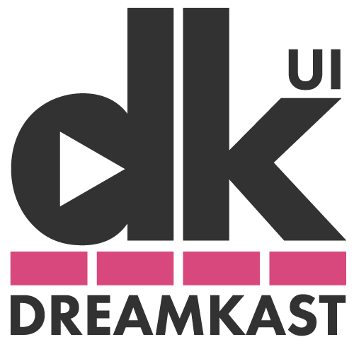

Dreamkast UI
============

Repository: https://github.com/cloudnativedaysjp/dreamkast-ui/

### これは何？

イベント当日に視聴者が動画配信を視聴するためのアプリケーション。Amazon IVSやVimeoの動画を埋め込み、視聴者に提供する。タブによるUIで簡単にトラックを切り替えられる設計が特徴

 Next.jsを使っており、TypeScriptで記述されている。

- IVS/Vimeoの埋め込み(イベントによって使い分ける)
- タブによるセッション切り替え機能
- チャット機能
- スポンサーブース(現状は無効化)

DreamkastとDreamkast UIの前段にはKubernetes上で稼働しているContourがおり、L7ロードバランスされている。/uiにアクセスしたときはDreamkast UIに繋がるようになっている

### どこで動いているか

- EKS(Kubernetes)

Manifest: https://github.com/cloudnativedaysjp/dreamkast-infra/tree/main/manifests/app/dreamkast

### 依存しているサービス

- Dreamkast - REST APIでイベントに関する情報を取得。またイベントの切り替えやチャットをWebSocketを使って通信している
- Karte - 利用者トラッキング
